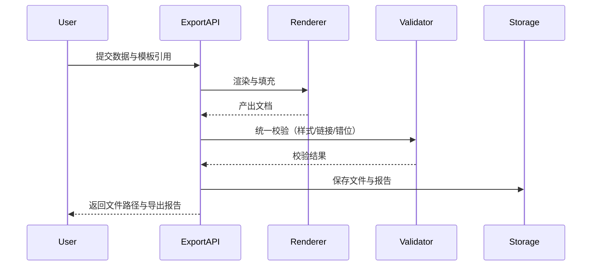

## 1. 项目概述

### 背景与目标
- 面向“结构化数据（JSON/CSV）→ 标准化文档（Word/PDF/HTML）”自动化转换，提供模板化与一致样式的导出能力，解决格式还原度低、样式不一致、批量效率差的问题。
- 交付形式：以 Python 包与 REST API（FastAPI）提供核心能力；通过模块化代码、配置模板与示例脚本便于集成。

### 核心价值与适用场景
- 核心价值：高还原样式、模板解耦、批量并行、可观测（导出报告与日志）、易扩展（Markdown/Excel 等新格式）。
- 适用场景：数据分析报告、业务报表、合同生成、科研文献定制导出、简历解析与排版等。

### 非目标与边界
- 不涉及特定业务逻辑与私有协议；仅依赖通用库（python-docx/jinja2/weasyprint 等）。
- 不负责模板的视觉设计，只负责模板版本管理与占位符渲染。
- PDF/Word 加密为加分项，非强制能力；如依赖系统组件（如 LibreOffice）不作为强制内置。

---

## 2. 术语与约定

### 占位符规范（高层）
- 文本占位符：`{{ title }}`、`{{ author }}`、`{{ date | date('%Y-%m-%d') }}`
- 表格占位符：`{{ table:data }}`（data 为列表/数据帧；支持列映射与合并配置）
- 图片占位符：`{{ image:logo }}`（值为 Base64 字符串、HTTP URL 或本地路径）
- 图表占位符：`{{ chart:sales_line }}`（基于 CSV/列表绘制折线/柱状图）

### 术语定义
- 模板（Template）：Word/PDF/HTML 文件或片段，包含占位符与样式；支持版本管理。
- 渲染（Render）：将结构化数据映射至模板占位符并产出目标文档的过程。
- 导出（Export）：将渲染结果保存为目标格式（Word/PDF/HTML/其他）。
- 校验（Validate）：对产出文档进行格式、链接、样式统一性等检查。

---

## 3. 需求分解

### 功能需求
- 模板管理：上传/下载/版本化、元数据与变更历史、页眉页脚/样式规范化。
- 动态数据填充：
  - 表格：自动匹配列数、支持列映射、合并单元格、分页控制。
  - 图表：基于 CSV/列表生成折线图/柱状图并嵌入文档（缓存复用）。
  - 图片：Base64/URL/本地路径插入，尺寸与对齐规则可配置。
- 批量导出：并行处理（如 100 份个性化报告），支持分块与流式写入，避免内存溢出。
- 格式校验：错位检查（表格维度/字段映射）、链接有效性、样式一致性（字体/页眉页脚）。
- 报告与日志：导出文件、导出报告（文件大小/页数/耗时）、错误日志。

### 非功能需求
- 性能：100 页文档生成耗时 ≤ 10 秒（单任务基线，视模板复杂度与硬件调优）。
- 稳定性：失败重试、幂等、断点续跑；完善的异常与错误码。
- 扩展性：渲染器/填充器/校验器插件化；新增 Markdown/Excel 等格式。
- 安全：模板与数据隔离；可选 PDF/Word 加密。

### 约束
- 仅依赖通用库；配置通过 YAML/JSON/环境变量注入；模板版本化管理。

---

## 4. 目标指标与验收标准
- 样式还原度 ≥ 95%，数据填充无错位（抽样人工校验 + 自动对比）。
- 支持 ≥ 3 种主流输出格式（Word/PDF/HTML）。
- 并行批量生成 100 份个性化报告不发生内存溢出（稳定通过基准测试）。
- 产出物完整：导出文件、导出报告（大小/页数/耗时）、错误日志。

---

## 5. 总体架构设计

```mermaid
flowchart LR
  In[结构化数据(JSON/CSV)] -->|解析/校验| Core[Core Service]
  Tmpl[模板管理] --> Core
  Core -->|渲染| Render[Jinja2 渲染层]
  Render --> Docx[python-docx 生成]
  Render --> Html[HTML 生成]
  Html --> Pdf[WeasyPrint 转 PDF]
  Core --> Validate[格式/链接/样式校验]
  Core --> Report[导出报告&日志]
  Core --> Storage[(本地/云存储)]
```

### 模块职责与边界
- Core Service：编排整体流程（解析→渲染→填充→导出→校验→报告→存储），对外暴露 API。
- Templates：模板的存储、加载、版本管理与元数据维护；与业务解耦。
- Renderers：Jinja2 模板层；对接 `python-docx` 生成 Word；HTML 渲染 + WeasyPrint 输出 PDF。
- Fillers：表格/图表/图片的具体填充策略，按占位符类型插件化扩展。
- Validators：统一校验入口，包含错位、链接有效性、样式统一性检查。
- Batch：批量并行、分块处理与队列/池化、回压、重试策略。
- Storage：抽象本地/云存储（文件落盘、元数据写入、路径与权限管理）。
- API：FastAPI 提供 REST 接口（函数/类方法）与 Pydantic 标准化输入/输出。

---

## 6. 技术选型与理由
- 渲染与文档
  - python-docx：成熟稳定、可精细控制段落/表格/样式；社区活跃。替代：docxtpl（更便捷模板化，但灵活性略弱）、Aspose（商业）。
  - jinja2：表达式与过滤器丰富、生态成熟，适合统一占位符语法。
  - weasyprint：高质量 HTML→PDF，CSS 支持良好。替代：wkhtmltopdf（依赖外部二进制）、ReportLab（代码驱动布局）。
- 图表：matplotlib（标准、稳定）或 plotly（交互/美观）。默认选 matplotlib，支持可插拔扩展。
- 并行：concurrent.futures（线程池/进程池简洁易用）；I/O 与 CPU 场景分离选择。
- 校验：requests（链接探测）、自研样式哈希（从模板抽取关键样式指纹）。

---

## 7. 目录结构与包设计

```text
easy_export/
  core/
    schema/           # 配置文件中的各配置项模型(使用pydantic进行验证)
    templates/        # 模板加载与版本管理
    renderers/        # 渲染器：docx/html/pdf
    fillers/          # 表格/图表/图片填充策略
    validators/       # 样式/链接/错位校验
    batch/            # 并行与分块处理
    storage/          # 本地/云存储抽象
    api/v1            # 函数/类方法对外接口
    routers.py        # 接口注册入口
  configs/
    config.example.yaml
  examples/
    sample_input.json
    sample_template.docx
  tests/
  mvp/                # MVP相关代码（可供参考）
main.py               # fast_api 启动入口
requirements.txt
README.md
```

---

## 8. 配置与环境

### 配置项清单与说明
- app：服务元信息（服务名、环境、时区、临时目录）
- logging：等级、格式、文件滚动策略、trace_id 注入开关
- storage：类型（local/s3/oss 等）、根路径/桶名、凭据、公开策略
- templates：模板根目录、版本策略（保留历史数/是否允许回滚）
- rendering：默认字体、页面大小、weasyprint 选项（DPI、合成等）
- batch：并行度、队列大小、块大小、超时、重试策略与回压
- validation：链接探测开关、超时、样式哈希策略、表格维度严格性
- security：PDF/Word 加密是否开启、算法、密码提供方式（ENV/密钥管理）

### config.example.yaml（示例）

```yaml
app:
  name: easy-export
  env: prod
  timezone: Asia/Shanghai
  work_dir: ./runtime

logging:
  level: INFO
  json: false
  file: ./runtime/logs/easy_export.log
  rotate:
    when: midnight
    backup_count: 7
  inject_trace_id: true

storage:
  type: local  # local | s3
  local:
    base_dir: ./outputs
  s3:
    bucket: my-bucket
    region: ap-southeast-1
    access_key: ${S3_ACCESS_KEY}
    secret_key: ${S3_SECRET_KEY}
    base_path: exports/

templates:
  base_dir: ./templates
  keep_versions: 20
  allow_rollback: true

rendering:
  default_font: "NotoSansCJK"
  page_size: A4
  html:
    base_url: ./assets
  weasyprint:
    dpi: 96
    presentational_hints: true
    optimize_images: true

batch:
  mode: auto       # auto | thread | process
  max_workers: 8
  queue_size: 200
  chunk_size: 50   # 数据分块大小
  timeout_sec: 30
  retry:
    max_attempts: 2
    backoff_sec: 1.5

validation:
  link_check:
    enabled: true
    timeout_sec: 3
  style_hash:
    enabled: true
    scope: ["font", "header_footer", "margins"]
  table_dimensions:
    strict: true

security:
  pdf_encrypt:
    enabled: false
    owner_password: ${PDF_OWNER_PWD}
    user_password: ${PDF_USER_PWD}
    permissions: ["print"]
  docx_encrypt:
    enabled: false
    password: ${DOCX_PWD}
```

---

## 9. 接口设计（对外 API）

### 标准化输入/输出
- 输入：`Dict` 或 `Path`（数据、模板 ID/路径、配置覆盖项）
- 输出：`Path`（导出文件路径）与报告 `Dict`（大小/页数/耗时/校验结果）

### Python 函数/类方法（核心）

```python
from pathlib import Path
from typing import Dict, Optional, List, Union

class ExportService:
    def __init__(self, config_path: Union[str, Path]):
        ...

    def export_single(self, *, 
                      data: Dict, 
                      template_ref: str, 
                      output_format: str = "docx",
                      overrides: Optional[Dict] = None) -> Dict:
        """
        参数:
          data: 结构化数据(JSON 解析后)
          template_ref: 模板引用(id 或 路径)
          output_format: docx | pdf | html
          overrides: 运行期覆盖配置
        返回:
          { "file_path": str, "report": {...}, "log_path": str }
        """
        ...

    def export_batch(self, *,
                     items: List[Dict],
                     output_format: str = "docx",
                     concurrency: Optional[int] = None) -> Dict:
        """
        参数:
          items: [{ data: Dict, template_ref: str, overrides: Dict }, ...]
        返回:
          { "success": int, "failed": int, "outputs": [ {...} ], "summary": {...} }
        """
        ...
```

### REST API（FastAPI）
- `POST /api/v1/export`：单文档导出
- `POST /api/v1/export/batch`：批量导出
- `GET /api/v1/templates`：模板列表/版本
- `POST /api/v1/templates`：上传新模板
- `POST /api/v1/templates/{template_id}/versions`：新增版本
- `GET /api/v1/reports/{task_id}`：查询导出报告与日志

### 异常与错误码规范
- 4xx：参数/模板/数据校验错误（如 40001 数据字段缺失、40002 模板不匹配）
- 5xx：渲染/导出/存储异常（如 50010 渲染失败、50020 存储失败）
- 返回统一结构：`{ code:int, message:str, detail:Dict, trace_id:str }`

---

## 10. 核心流程设计（含时序图）

### 单文档导出流程
1) 解析请求 → 校验数据与模板引用 → 载入模板与配置  
2) Jinja2 渲染占位符 → 进入渲染器（Word/HTML）  
3) python-docx 生成 `.docx` 或 HTML 生成后 weasyprint 转 `.pdf`  
4) 执行校验（错位/链接/样式） → 生成导出报告  
5) 存储文件与日志 → 返回路径与报告

### 批量并行导出流程（队列/池化/限流/回压/重试）
- 基于线程池/进程池调度；配置队列大小与回压；失败任务按指数退避重试；合并导出统计与报告。



---

## 11. 模板管理与占位符规范

### 模板组织与版本管理
- 模板存储于 `templates/`；元数据记录模板 `id/name/version/created_by/hash`。
- 版本策略：默认保留最近 N 个版本（可回滚）；存储变更日志（差异标签、作者、时间）。
- 引用方式：`template_ref` 支持 `id@version` 或 物理路径；路径受白名单/沙箱限制。

### 占位符设计与映射
- 文本：`{{ key }}`，支持过滤器（`date`, `upper`, 自定义 formatter）。
- 表格：`{{ table:key }}`，数据结构：`List[Dict]` 或 `List[List]`。支持：
  - 列映射：`columns: [ {name:"列名", key:"data_key"} ]`
  - 合并单元格：`merge: { by: ["dept"], strategy: "span" }`
  - 分页控制：`page_break: true`（超过行数自动分页）
- 图片：`{{ image:key }}`，支持 `base64:`、`http(s)://`、相对/绝对路径；尺寸与对齐在模板中设定，可被配置覆盖。
- 图表：`{{ chart:key }}`，配置图型 `type: line|bar`、数据源（CSV/列表）、主题、尺寸；生成缓存（输入哈希命中复用）。

### 兼容性与回退
- 模板校验失败或占位符缺失：可配置回退策略（忽略/报错/默认值填充）。
- 保留原模板样式优先；样式缺失时按默认字体与页眉页脚回退。

---

## 12. 动态填充策略

- 表格：
  - 自动列宽策略：优先模板列样式；缺省按内容长度估算与页面宽度分配。
  - 合并规则：按指定字段一致性纵向合并；边框与底色继承首单元格。
  - 空值处理：可配置“保留空单元格/填充占位文本/删除行”。
- 图片：
  - 源自动识别（Base64/URL/Path）；失败回退为替代图或占位框。
  - 尺寸策略：保持长宽比，优先模板尺寸，可配置最大宽高。
- 图表：
  - 使用 matplotlib/plotly 生成图片缓存在临时目录；启用内容哈希避免重复渲染。
  - 支持主题与字体配置，保证中英文混排可靠。

---

## 13. 并行与大文件处理

- 并行模型：
  - auto 策略：根据输出格式选择线程池（I/O 型，如存储/网络）或进程池（CPU 型，如复杂 PDF 排版）。
  - 配置 `max_workers/queue_size/timeout/retry/backoff`；支持回压（队列满时阻塞或丢弃策略）。
- 大文件策略：
  - 分块渲染：长表格/大图片按块写入；HTML→PDF 采用流式管道。
  - 内存控制：限制并发/释放中间对象/图片临时文件落盘。
  - 断点续跑：任务级 checkpoint（已完成列表），重试仅对失败项。

---

## 14. 校验与质量保障

- 数据错位：表格维度对齐（列数/字段映射）、必填字段校验、类型与范围校验。
- 链接有效性：HTTP 状态探测与超时设置；可配置忽略内网域名。
- 样式统一性：从模板抽取关键样式生成哈希（字体、字号、行距、页眉页脚），与产出文件抽取对比。
- 度量指标：页数、体积、耗时、失败率、重试次数；导出报告统一归档。
- 日志：分级（INFO/WARN/ERROR）、trace_id 贯穿；必要时输出渲染上下文摘要（脱敏）。

---

## 15. 安全与合规

- 模板与数据隔离：模板白名单路径/沙箱；拒绝任意文件访问。
- 依赖安全：固定版本与哈希；定期安全扫描。
- PDF 加密（可选）：使用 pikepdf/PyPDF2 设置所有者/用户密码与权限（打印/复制）。
- Word 加密（可选）：若需强加密可接入系统级 LibreOffice headless 或使用 ZIP AES 包装交付作为变通；默认关闭。
- 秘钥与密码：通过环境变量或外部密钥管理（不写入日志/报告）。

---

## 16. 扩展性设计

- 渲染器接口（示例）

```python
class BaseRenderer:
    format: str  # "docx" | "html" | "pdf"
    def render(self, template, context) -> Path: ...
```

- 填充器接口（表格/图表/图片）

```python
class BaseFiller:
    placeholder_type: str  # "table" | "image" | "chart"
    def apply(self, document, payload, config) -> None: ...
```

- 校验器接口

```python
class BaseValidator:
    def validate(self, file_path: Path, rules: dict) -> Dict: ...
```

- 新增导出格式（Markdown/Excel）：实现对应 Renderer 与（可选）Filler/Validator，注册到工厂与路由。

---

## 17. 测试策略与样例

- 单元测试：模板管理、占位符解析、表格/图片/图表填充、链接探测、样式哈希。
- 集成测试：端到端流（输入→导出→校验→报告），覆盖三种主流格式；比较基准模板快照。
- 性能基准：100 页模板在目标硬件下 ≤ 10s；并发 100 份报告稳定完成，无 OOM。
- 示例数据：`examples/sample_input.json`、`examples/sample_template.docx`；提供典型边界案例（空数据、长表、坏链接）。

---

## 18. 交付物与落地计划

### 交付清单
- Python 包（`easy_export`）、REST API（FastAPI）、示例脚本与 `requirements.txt`
- `config.example.yaml`、模板示例与占位符指南
- 文档：API 说明、集成示例（如“如何在 Django 项目中调用模块”）、运维指引

### 版本里程碑
- v0.1 MVP：单文档导出（Word/HTML→PDF）、基础校验、模板上传与版本化
- v0.2 批量与并行：线程/进程池、分块/回压/重试、导出报告
- v0.3 扩展与质量：图表生成缓存、样式哈希、更多校验项
- v0.4 安全与增强：PDF 加密、可选 Word 加密方案、云存储适配

### 风险与缓解
- 性能波动：提供可观测指标与可调并发；预热模板与字体缓存。
- 模板兼容：建立模板规范与校验器；提供回退策略与错误指引。
- 依赖变更：锁定版本与灰度升级；关键路径提供替代实现。

---

### 附：FastAPI 端点示例（简版）

```python
from fastapi import FastAPI
from pydantic import BaseModel
from typing import Dict, List, Optional

app = FastAPI()

class ExportItem(BaseModel):
    data: Dict
    template_ref: str
    overrides: Optional[Dict] = None

@app.post("/api/v1/export")
def export_api(item: ExportItem, output_format: str = "docx"):
    # 调用 ExportService.export_single(...)
    return {"file_path": "/outputs/report.docx", "report": {"pages": 10, "elapsed_ms": 320}}

@app.post("/api/v1/export/batch")
def export_batch_api(items: List[ExportItem], output_format: str = "pdf"):
    # 调用 ExportService.export_batch(...)
    return {"success": 10, "failed": 0, "summary": {"elapsed_ms": 2800}}
```


